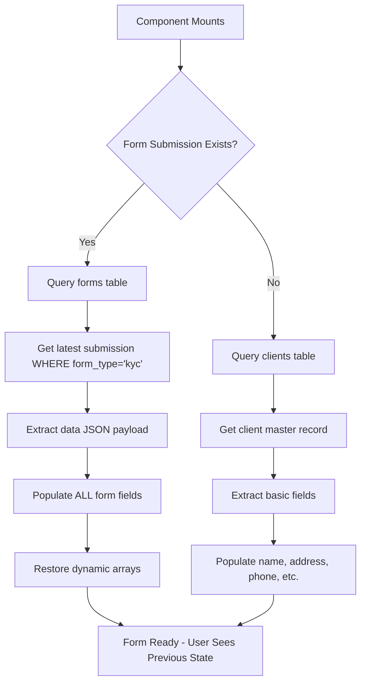
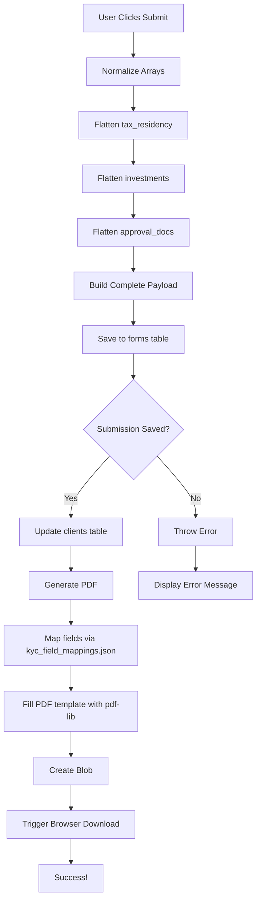

# KYC Form System - Complete Documentation

## Table of Contents
1. [System Overview](#system-overview)
2. [Architecture](#architecture)
3. [Data Flow](#data-flow)
4. [Database Schema](#database-schema)
5. [PDF Generation System](#pdf-generation-system)
6. [Form Fields Reference](#form-fields-reference)
7. [Development Guide](#development-guide)
8. [Troubleshooting](#troubleshooting)

---

## System Overview

The KYC (Know Your Client) Form System is a comprehensive client information collection and compliance documentation platform built for financial services. It enables agents to collect detailed client profiles, investment preferences, and identity verification data, then generate filled PDF documents for regulatory compliance.

### Key Features

- **Dual Account Support**: Individual and joint account configurations
- **Investment Profiling**: Comprehensive risk assessment and investment objectives tracking
- **Dynamic Custom Fields**: User-defined tax residencies, investment types, and approval documents
- **Form Persistence**: Complete audit trail with submission history
- **PDF Generation**: Automated filling of regulatory PDF templates
- **Dark Mode**: Full theme support with localStorage persistence

---

## Architecture

### Three-Tier Data Storage Pattern

The system uses a sophisticated data storage architecture to separate concerns and enable flexibility:

#### 1. **Clients Table** (Master Identity Records)
```sql
Purpose: Core client identity and contact information
Schema:
  - id: UUID (primary key)
  - email: text
  - first_name: text
  - last_name: text
  - sin: text (Social Insurance Number)
  - dob: date
  - address, city, province, postal_code: text
  - phone_residence, phone_business: text
  - employer, employer_address, occupation: text
  - financial fields (annual_income, net_worth, assets, liabilities)
  - tax_residency, investments: arrays
  - bank details
  - Created/updated timestamps
```

**Role**: 
- Source of truth for client identity
- Updated when forms are submitted
- Used for fallback prefill when no form history exists

#### 2. **Forms Table** (Submission Audit Trail)
```sql
Purpose: Complete history of all form submissions
Schema:
  - id: UUID (primary key)
  - client_id: UUID (foreign key to clients)
  - form_type: text ('kyc', 'trade_ticket', 'investor_profile', etc.)
  - form_template_id: UUID (links to template used)
  - status: text ('draft', 'submitted', 'approved')
  - data: jsonb (COMPLETE form state snapshot)
  - pdf_url: text (template URL used)
  - created_at, updated_at: timestamps
```

**Role**:
- Immutable submission records (each save = new row)
- Complete form state preserved as JSON
- Enables audit trail and historical tracking
- Primary source for prefilling form on reload

#### 3. **Form Templates Table** (PDF Configuration)
```sql
Purpose: Metadata about available form templates
Schema:
  - id: UUID (primary key)
  - name: text ('KYC Application Form')
  - form_type: text ('kyc')
  - pdf_url: text (Supabase Storage URL to blank template)
  - description: text
  - created_at, updated_at: timestamps
```

**Role**:
- Stores references to PDF templates
- Provides URLs for PDF generation
- Enables multiple template versions

---

## Data Flow

### Form Prefill Workflow

When a user opens the KYC form, the system uses a two-tier prefill strategy:



**Implementation Details:**

1. **TIER 1 (Preferred): Latest Submission**
   ```javascript
   // Query for most recent KYC submission
   const { data: latestSubmission } = await supabase
     .from('forms')
     .select('data')
     .eq('client_id', id)
     .eq('form_type', 'kyc')
     .order('created_at', { ascending: false })
     .limit(1)
     .single();
   
   // If found, use complete data payload
   if (latestSubmission?.data) {
     reset(latestSubmission.data); // Populate ALL fields
     // Restore arrays for "Other" checkboxes
     setOtherCountries(latestSubmission.data.other_countries || []);
     setOtherInvestments(latestSubmission.data.other_investments || []);
   }
   ```

2. **TIER 2 (Fallback): Client Record**
   ```javascript
   // Only executes if no submission found
   const { data: client } = await supabase
     .from('clients')
     .select('*')
     .eq('id', id)
     .single();
   
   if (client) {
     reset({
       first_name: client.first_name,
       last_name: client.last_name,
       email: client.email,
       // ...basic fields only
     });
   }
   ```

### Form Submission Workflow

When a user submits the KYC form:



**Array Normalization Example:**

```javascript
// INPUT (from form):
tax_residency: ['Canada', 'Other']
otherCountries: ['Mexico', 'UK']

// NORMALIZATION LOGIC:
const finalTaxResidency = residencyArray.flatMap(item => 
  item === 'Other' ? otherCountries : item
);

// OUTPUT (to database):
tax_residency: ['Canada', 'Mexico', 'UK']
```

---

## Database Schema

### Complete Field Mappings

#### Core Personal Information
| Form Field | Type | Database Location | PDF Field | Notes |
|-----------|------|-------------------|-----------|-------|
| `title` | select | clients.title | Mr/Mrs/Miss/Ms/Dr | Radio group in PDF |
| `first_name` | text | clients.first_name | First Name | Required |
| `last_name` | text | clients.last_name | Last Name | Required |
| `email` | email | clients.email | Email | |
| `dob` | date | clients.dob | Date of Birth | |
| `sin` | text | clients.sin | SIN | Format: XXX-XXX-XXX |
| `language_preference` | select | clients.language_preference | English/French | Radio group |
| `phone_residence` | text | clients.phone_residence | Residence Phone | |
| `phone_business` | text | clients.phone_business | Business Phone | |

#### Joint Account Fields
| Form Field | Type | Storage | Notes |
|-----------|------|---------|-------|
| `joint_account` | checkbox | forms.data.joint_account | Boolean flag |
| `joint_applicant.first_name` | text | forms.data.joint_applicant | Nested object |
| `joint_applicant.last_name` | text | forms.data.joint_applicant | |
| `joint_applicant.email` | email | forms.data.joint_applicant | |
| `joint_applicant.dob` | date | forms.data.joint_applicant | |
| `joint_applicant.sin` | text | forms.data.joint_applicant | |
| `joint_applicant.address` | text | forms.data.joint_applicant | |
| `joint_applicant.city` | text | forms.data.joint_applicant | |
| `joint_applicant.province` | select | forms.data.joint_applicant | |
| `joint_applicant.postal_code` | text | forms.data.joint_applicant | |
| `joint_applicant.occupation` | text | forms.data.joint_applicant | |
| `joint_applicant.employer` | text | forms.data.joint_applicant | |
| `joint_applicant.annual_income` | number | forms.data.joint_applicant | |
| `joint_applicant.risk_tolerance` | select | forms.data.joint_applicant | |

#### Address Information
| Form Field | Type | Database Location | PDF Field |
|-----------|------|-------------------|-----------|
| `address` | text | clients.address | Address |
| `city` | text | clients.city | City |
| `province` | select | clients.province | Province |
| `postal_code` | text | clients.postal_code | Postal Code |

#### Tax Residency (Dynamic Array)
| Form Field | Type | Storage | Notes |
|-----------|------|---------|-------|
| `tax_residency` | checkbox[] | clients.tax_residency | Array: ['Canada', 'USA', ...] |
| `other_countries` | array | forms.data.other_countries | User-defined countries |

**Normalization Flow:**
1. User checks: Canada ✓, Other ✓
2. User adds: "Mexico", "UK" to other_countries
3. Final array: `['Canada', 'Mexico', 'UK']`
4. Saved to both `clients.tax_residency` and `forms.data.tax_residency`

#### Employment Information
| Form Field | Type | Database Location | PDF Field |
|-----------|------|-------------------|-----------|
| `employer` | text | clients.employer | Employer |
| `employer_address` | text | clients.employer_address | Employer Address |
| `occupation` | text | clients.occupation | Occupation |

#### Financial Information
| Form Field | Type | Database Location | PDF Field | Notes |
|-----------|------|-------------------|-----------|-------|
| `annual_income` | number | clients.annual_income | Bucketed ranges | Auto-bucketed for PDF |
| `fixed_assets` | number | clients.fixed_assets | Fixed Assets | |
| `liquid_assets` | number | clients.liquid_assets | Liquid Assets | |
| `liabilities` | number | clients.liabilities | Liabilities | |
| `net_worth` | number | clients.net_worth | Net Worth | Auto-calculated |
| `investment_knowledge` | select | clients.investment_knowledge | Novice/Fair/Good/Sophisticated | |

**Annual Income Bucketing:**
```javascript
// User enters: 75000
// System buckets to: "$50,000-$74,999"
// PDF receives: Radio button for "$50,000-$74,999" toggled ON

Brackets:
- < $25,000
- $25,000-$49,999
- $50,000-$74,999
- $75,000-$99,999
- $100,000-$124,999
- $125,000-$199,999
- $200,000-$999,999
- $1M+
```

#### Investment Information
| Form Field | Type | Database Location | PDF Field | Notes |
|-----------|------|-------------------|-----------|-------|
| `account_type` | radio | forms.data.account_type | Individual Account/Joint | Synced with joint_account |
| `plan_status` | radio | forms.data.plan_status | New/Updated | |
| `plan_id` | text | forms.data.plan_id | Plan ID | Policy/account number |
| `plan_type` | select | forms.data.plan_type | NonRegistered/RRSP/TFSA/etc. | Radio group |
| `objective_safety` | number | forms.data.objective_safety | Safety_1 | Portfolio allocation % |
| `objective_income` | number | forms.data.objective_income | Income_1 | Portfolio allocation % |
| `objective_growth` | number | forms.data.objective_growth | Growth_1 | Portfolio allocation % |
| `objective_speculative` | number | forms.data.objective_speculative | Speculative_1 | Portfolio allocation % |
| `time_horizon` | select | forms.data.time_horizon | 1 Year/1-3 Years/etc. | Radio group |
| `risk_tolerance` | select | clients.risk_tolerance | Low/Low-Medium/Medium/etc. | Radio group |
| `investment_purpose` | select | forms.data.investment_purpose | Retirement/Estate/Education/Tax | Radio group |
| `investment_objective` | select | clients.investment_objective | Safety/Income/Growth/Aggressive | Legacy field |

#### Investment Types (Dynamic Array)
| Form Field | Type | Storage | Notes |
|-----------|------|---------|-------|
| `investments` | checkbox[] | clients.investments | Array of investment types |
| `other_investments` | array | forms.data.other_investments | User-defined types |

**Standard Options:**
- Bonds
- Segregated Funds
- Stocks
- Mutual Funds
- Term Deposits/GIC
- Real Estate & Mortgages
- Other (→ triggers custom input)

#### Banking Information
| Form Field | Type | Database Location | PDF Field |
|-----------|------|-------------------|-----------|
| `bank_name` | text | clients.bank_name | Financial Institution Name |
| `bank_transit` | text | clients.bank_transit | Transit Number |
| `bank_institution` | text | clients.bank_institution | Institution Number |
| `bank_account` | text | clients.bank_account | Account Number |
| `bank_address` | text | clients.bank_address | Address_4 |
| `bank_city` | text | clients.bank_city | City_3 |
| `bank_province` | text | clients.bank_province | Province_3 |
| `bank_postal_code` | text | clients.bank_postal_code | Postal Code_3 |

#### Approval Documentation
| Form Field | Type | Storage | Notes |
|-----------|------|---------|-------|
| `approval_documents` | checkbox[] | clients.approval_documents | Array of document types |
| `approval_documents_other` | text | forms.data | Semicolon-separated list |
| `document_number` | text | clients.document_number | Document Number |
| `document_jurisdiction` | text | clients.document_jurisdiction | Jurisdiction |
| `document_expiry` | date | clients.document_expiry | Expiry |
| `citizenship` | radio | clients.citizenship | Canadian/US/Other |
| `citizenship_other` | text | clients.citizenship_other | Shown when Other selected |
| `id_verified_physical` | checkbox | clients.id_verified_physical | In-person verification flag |

---

## PDF Generation System

### Overview

The PDF generation system uses a sophisticated mapping strategy to translate form data into filled PDF fields. This involves:

1. **Field Mapping Configuration** (`kyc_field_mappings.json`)
2. **PDF Metadata** (`kyc_pdf_fields.json`)
3. **Fill Logic** (`kycFiller.js`)
4. **PDF Library** (`pdf-lib` via `pdfGenerator.js`)

### Field Mapping Configuration

`src/data/kyc_field_mappings.json` defines how form fields map to PDF fields:

```json
{
  "first_name": {
    "type": "text",
    "pdf_field": "First Name"
  },
  "annual_income": {
    "type": "radio_group",
    "pdf_field": "25000  49999",
    "value_map": {
      "<$25,000": "25000",
      "$25,000-$49,999": "25000  49999",
      "$50,000-$74,999": "50000  74999",
      "$75,000-$99,999": "75000  99999",
      "$100,000-$124,999": "100000  124999",
      "$125,000-$199,999": "125000  199999",
      "$200,000-$999,999": "200000  999999",
      "$1M+": "1M"
    }
  },
  "risk_tolerance": {
    "type": "radio_group",
    "pdf_field": "Low",
    "value_map": {
      "Low": "Low",
      "Low-Medium": "LowMedium",
      "Medium": "Medium",
      "Medium-High": "MediumHigh",
      "High": "High"
    }
  }
}
```

**Field Type Definitions:**

| Type | Description | Example |
|------|-------------|---------|
| `text` | Direct string mapping | `{"type": "text", "pdf_field": "First Name"}` |
| `checkbox` | Boolean On/Off toggle | `{"type": "checkbox", "pdf_field": "RRSP", "checked_value": "On"}` |
| `radio_group` | Single-choice from options | See annual_income example above |
| `array` | Multi-value field (joined with ", ") | Tax residency countries |

### PDF Fill Logic

`src/utils/kycFiller.js` orchestrates the PDF filling process:

```javascript
// 1. BUCKET ANNUAL INCOME
const bucketAnnualIncome = (val) => {
  const num = Number(val);
  if (num < 25000) return '<$25,000';
  if (num < 50000) return '$25,000-$49,999';
  if (num < 75000) return '$50,000-$74,999';
  // ... more brackets
};

// 2. NORMALIZE FORM DATA
const normalizedFormData = {
  ...formData,
  annual_income: bucketAnnualIncome(formData.annual_income)
};

// 3. MAP TO PDF FIELDS
Object.entries(kycFieldMappings).forEach(([logicalField, mapping]) => {
  const val = normalizedFormData[logicalField];
  
  if (mapping.type === 'radio_group') {
    // Map value to PDF field name
    const mapped = mapping.value_map[String(val)];
    // Set that field to "On" to toggle radio button
    pdfData[mapped] = 'On';
  }
  
  if (mapping.type === 'checkbox') {
    pdfData[mapping.pdf_field] = val ? 'On' : 'Off';
  }
  
  if (mapping.type === 'text') {
    pdfData[mapping.pdf_field] = String(val);
  }
  
  if (mapping.type === 'array' && Array.isArray(val)) {
    pdfData[mapping.pdf_field] = val.join(', ');
  }
});

// 4. FILL PDF WITH MAPPED DATA
await fillPDF(pdfUrl, pdfData);
```

### Annual Income Special Handling

Annual income requires special handling because users enter numeric values but PDFs use radio buttons:

```javascript
// USER INPUT (form field)
annual_income: 75000  // number input

// STEP 1: Bucket to range (in kycFiller.js)
bucketAnnualIncome(75000) → "$75,000-$99,999"

// STEP 2: Map to PDF field (via kyc_field_mappings.json)
value_map["$75,000-$99,999"] → "75000  99999"

// STEP 3: Set PDF radio button
pdfData["75000  99999"] = "On"

// RESULT: Radio button for $75,000-$99,999 is selected in PDF
```

### Joint Account PDF Mapping

Joint accounts have parallel PDF fields with "_2" suffix:

```json
{
  "annual_income": {
    "type": "radio_group",
    "pdf_field": "25000  49999",
    "value_map": { /* individual ranges */ }
  },
  "joint_annual_income": {
    "type": "radio_group",
    "pdf_field": "25000  49999_2",
    "value_map": { /* joint ranges with _2 suffix */ }
  }
}
```

---

## Form Fields Reference

### Complete Field List with Descriptions

#### Section: Personal Information

| Field | Label | Type | Required | Validation | Notes |
|-------|-------|------|----------|------------|-------|
| `title` | Title | Select | No | Mr./Mrs./Miss/Ms./Dr./Other | Dropdown |
| `first_name` | First Name | Text | Yes | Non-empty | - |
| `last_name` | Last Name | Text | Yes | Non-empty | - |
| `email` | Email | Email | No | Valid email format | - |
| `language_preference` | Preferred Language | Select | No | English/French | Default: English |
| `dob` | Date of Birth | Date | No | Valid date | - |
| `sin` | SIN | Text | No | Format XXX-XXX-XXX | Social Insurance Number |
| `phone_residence` | Residence Phone | Text | No | - | - |
| `phone_business` | Business Phone | Text | No | - | - |

#### Section: Joint Applicant (Conditional - shown when `joint_account` is checked)

| Field | Label | Type | Required | Notes |
|-------|-------|------|----------|-------|
| `joint_applicant.first_name` | First Name | Text | No | - |
| `joint_applicant.last_name` | Last Name | Text | No | - |
| `joint_applicant.email` | Email | Email | No | - |
| `joint_applicant.phone` | Phone | Text | No | - |
| `joint_applicant.dob` | Date of Birth | Date | No | - |
| `joint_applicant.sin` | SIN | Text | No | - |
| `joint_applicant.address` | Street Address | Text | No | - |
| `joint_applicant.city` | City | Text | No | - |
| `joint_applicant.province` | Province | Select | No | Canadian provinces/territories |
| `joint_applicant.postal_code` | Postal Code | Text | No | Format: A1A 1A1 |
| `joint_applicant.occupation` | Occupation | Text | No | - |
| `joint_applicant.employer` | Employer | Text | No | - |
| `joint_applicant.annual_income` | Annual Income | Number | No | - |
| `joint_applicant.risk_tolerance` | Risk Tolerance | Select | No | Low/Medium/High |

#### Section: Tax Residency

| Field | Label | Type | Options | Notes |
|-------|-------|------|---------|-------|
| `tax_residency` | Countries | Checkbox[] | Canada, USA, Other | Multi-select |
| (dynamic) `other_countries` | Other Countries | Array | - | Shown when "Other" checked |

**Usage:**
- User checks: Canada ✓, USA ✓, Other ✓
- "Other" reveals text input
- User adds: "Mexico" → click Add button
- User adds: "United Kingdom" → click Add button
- Result: `tax_residency = ['Canada', 'USA', 'Mexico', 'United Kingdom']`

#### Section: Address Information

| Field | Label | Type | Required | Notes |
|-------|-------|------|----------|-------|
| `address` | Street Address | Text | No | - |
| `city` | City | Text | No | - |
| `province` | Province | Select | No | Canadian provinces/territories |
| `postal_code` | Postal Code | Text | No | Format: A1A 1A1 |

#### Section: Employment Information

| Field | Label | Type | Required | Notes |
|-------|-------|------|----------|-------|
| `employer` | Employer | Text | No | - |
| `employer_address` | Employer Address | Text | No | Full employer address |
| `occupation` | Occupation | Text | No | - |

#### Section: Financial Information

| Field | Label | Type | Required | Auto-Calculated | Notes |
|-------|-------|------|----------|-----------------|-------|
| `annual_income` | Annual Income | Number | No | No | Placeholder: 75000 |
| `fixed_assets` | Fixed Assets | Number | No | No | Placeholder: 100000 |
| `liquid_assets` | Liquid Assets | Number | No | No | Placeholder: 50000 |
| `liabilities` | Liabilities | Number | No | No | Placeholder: 20000 |
| `net_worth` | Net Worth | Number | No | **Yes** | = fixed + liquid - liabilities |
| `investment_knowledge` | Investment Knowledge | Select | No | No | None/Limited/Good/Expert |

**Net Worth Auto-Calculation:**
```javascript
useEffect(() => {
  const fixed = parseFloat(watch('fixed_assets')) || 0;
  const liquid = parseFloat(watch('liquid_assets')) || 0;
  const liabilities = parseFloat(watch('liabilities')) || 0;
  const computed = fixed + liquid - liabilities;
  setValue('net_worth', Math.round(computed));
}, [watch('fixed_assets'), watch('liquid_assets'), watch('liabilities')]);
```

#### Section: Investment Information

| Field | Label | Type | Options | Notes |
|-------|-------|------|---------|-------|
| `account_type` | Account Type | Radio | individual, joint | Synced with joint_account checkbox |
| `plan_status` | Plan Status | Radio | New, Updated | - |
| `plan_id` | Plan ID | Text | - | Policy/account number |
| `plan_type` | Plan Type | Select | Non-Registered, RRSP, RESP, RRIF, LIRA, TFSA, SRSP, RDSP, LIF, Other | - |
| `objective_safety` | Safety | Number | - | Portfolio allocation % |
| `objective_income` | Income | Number | - | Portfolio allocation % |
| `objective_growth` | Growth | Number | - | Portfolio allocation % |
| `objective_speculative` | Speculative | Number | - | Portfolio allocation % |
| `time_horizon` | Time Horizon | Select | <1 year, 1-3 years, 4-6 years, 7-9 years, 10+ years, 20+ years | - |
| `risk_tolerance` | Risk Tolerance | Select | Low, Low-Medium, Medium, Medium-High, High | Expanded options |
| `investment_purpose` | Investment Purpose | Select | Retirement Planning, Estate Planning, Child Education, Tax Planning, Other | - |
| `investment_objective` | Primary Investment Objective | Select | Safety, Income, Growth, Aggressive Growth | Legacy field |

**Portfolio Allocation Note:**
The objective fields (safety, income, growth, speculative) should ideally total 100% if using percentages, but this is not enforced by validation.

#### Section: Investment Types

| Field | Label | Type | Options | Notes |
|-------|-------|------|---------|-------|
| `investments` | Investment Types | Checkbox[] | Bonds, Segregated Funds, Stocks, Mutual Funds, Term Deposits/GIC, Real Estate & Mortgages, Other | Multi-select |
| (dynamic) `other_investments` | Other Investments | Array | - | Shown when "Other" checked |

**Usage:**
- User checks: Bonds ✓, Stocks ✓, Other ✓
- "Other" reveals text input
- User enters: "Cryptocurrency" → click Add
- User enters: "Precious Metals" → click Add
- Result: `investments = ['Bonds', 'Stocks', 'Cryptocurrency', 'Precious Metals']`

#### Section: Banking Information

| Field | Label | Type | Required | Notes |
|-------|-------|------|----------|-------|
| `bank_name` | Financial Institution Name | Text | No | - |
| `bank_transit` | Transit Number | Text | No | - |
| `bank_institution` | Institution Number | Text | No | - |
| `bank_account` | Account Number | Text | No | - |
| `bank_address` | Bank Address | Text | No | - |
| `bank_city` | City | Text | No | - |
| `bank_province` | Province | Select | No | Canadian provinces/territories |
| `bank_postal_code` | Postal Code | Text | No | Format: A1A 1A1 |

#### Section: Client Approval Documentation

| Field | Label | Type | Options | Notes |
|-------|-------|------|---------|-------|
| `approval_documents` | Identification Documents | Checkbox[] | Driver's License, Birth Certificate, Passport, Other | Multi-select |
| `approval_documents_other` | Other Documents | Text | - | Semicolon-separated list |
| `document_number` | Document Number | Text | - | - |
| `document_jurisdiction` | Jurisdiction | Text | - | - |
| `document_expiry` | Expiry Date | Date | - | - |
| `citizenship` | Citizenship | Radio | Canadian, U.S., Other | - |
| `citizenship_other` | Specify Citizenship | Text | - | Shown when "Other" selected |
| `id_verified_physical` | Physical Verification | Checkbox | - | "I have met this client in person..." |

**Approval Documents Other Example:**
- User checks: Driver's License ✓, Other ✓
- "Other" reveals text input
- User enters: "National ID; Military ID; Health Card"
- Result: `approval_documents = ["Driver's License", "National ID", "Military ID", "Health Card"]`

---

## Development Guide

### Setup Instructions

1. **Clone Repository**
   ```bash
   git clone <repository-url>
   cd my_website
   ```

2. **Install Dependencies**
   ```bash
   npm install
   ```

3. **Configure Supabase**
   - Create `.env` file:
     ```
     VITE_SUPABASE_URL=https://your-project.supabase.co
     VITE_SUPABASE_ANON_KEY=your-anon-key
     ```

4. **Set Up Database**
   ```sql
   -- Run migrations
   psql -h <host> -U <user> -d <database> -f migrations/add_client_fields.sql
   ```

5. **Upload PDF Template**
   - Upload blank KYC PDF to Supabase Storage
   - Insert record into `form_templates` table:
     ```sql
     INSERT INTO form_templates (name, form_type, pdf_url)
     VALUES (
       'KYC Application Form',
       'kyc',
       'https://your-storage-url/kyc_template.pdf'
     );
     ```

6. **Start Development Server**
   ```bash
   npm run dev
   ```

### File Structure

```
src/
├── components/
│   ├── KYCForm.jsx           # Main form component (1300+ lines)
│   ├── AgentGate.jsx         # Authentication gate
│   ├── AgentLogin.jsx        # Login page
│   └── ClientsTable.jsx      # Client list view
├── data/
│   ├── kyc_field_mappings.json    # Form-to-PDF field mappings
│   └── kyc_pdf_fields.json         # PDF metadata
├── utils/
│   ├── kycFiller.js          # PDF filling logic
│   ├── pdfGenerator.js       # pdf-lib wrapper
│   └── logger.js             # Logging utility
├── AuthContext.jsx           # Auth state management
├── supabaseClient.js         # Supabase client configuration
└── App.jsx                   # Main app component

data/
└── client_form_field_mapping.json  # Legacy mapping reference

migrations/
└── add_client_fields.sql    # Database schema migrations

scripts/
├── list_pdf_fields.py       # PDF field discovery tool
└── generate_full_mapping.py # Mapping generator
```

### Adding New Form Fields

1. **Add to UI** (`KYCForm.jsx`)
   ```jsx
   <div>
     <label>New Field</label>
     <input {...register('new_field')} />
   </div>
   ```

2. **Add to Database Schema** (if persisting to clients table)
   ```sql
   ALTER TABLE clients ADD COLUMN new_field TEXT;
   ```

3. **Add to PDF Mapping** (`kyc_field_mappings.json`)
   ```json
   {
     "new_field": {
       "type": "text",
       "pdf_field": "New Field PDF Name"
     }
   }
   ```

4. **Update Client Payload** (in `onSubmit`)
   ```javascript
   const clientUpdatePayload = {
     // ... existing fields
     new_field: data.new_field,
   };
   ```

### Testing

#### Manual Testing Checklist

- [ ] **Form Prefill**
  - [ ] First-time load (no submission history)
  - [ ] Subsequent load (with submission history)
  - [ ] Dynamic arrays restore correctly

- [ ] **Form Submission**
  - [ ] Individual account
  - [ ] Joint account
  - [ ] All fields save to database
  - [ ] PDF generates successfully
  - [ ] PDF contains all filled data

- [ ] **Dynamic Arrays**
  - [ ] Tax Residency: Add/remove countries
  - [ ] Investment Types: Add/remove types
  - [ ] Approval Documents: Semicolon parsing

- [ ] **Auto-Calculations**
  - [ ] Net worth updates on asset/liability change
  - [ ] Account type syncs with joint toggle

- [ ] **PDF Mapping**
  - [ ] Annual income brackets correctly
  - [ ] Radio buttons toggle in PDF
  - [ ] Checkboxes show On/Off
  - [ ] Text fields populate
  - [ ] Arrays join with commas

- [ ] **Dark Mode**
  - [ ] Toggle works
  - [ ] Preference persists on reload
  - [ ] All sections render correctly

### Debugging Tips

#### Enable Logging
```javascript
// In browser console
localStorage.setItem('LOG_LEVEL', 'debug');
// Reload page
```

#### Inspect Form State
```javascript
// In KYCForm.jsx
console.log('Form data:', watch());
console.log('Other countries:', otherCountries);
console.log('Other investments:', otherInvestments);
```

#### Check PDF Field Names
```bash
# Use Python script to list all PDF fields
cd scripts
python list_pdf_fields.py path/to/template.pdf
```

#### Verify Database Records
```sql
-- Check latest submission
SELECT * FROM forms 
WHERE client_id = '<uuid>' 
  AND form_type = 'kyc' 
ORDER BY created_at DESC 
LIMIT 1;

-- Check client record
SELECT * FROM clients WHERE id = '<uuid>';
```

---

## Troubleshooting

### Common Issues

#### 1. PDF Not Generating

**Symptoms:**
- "KYC PDF template not available" error
- PDF download doesn't trigger

**Solutions:**
```javascript
// Check if template is loaded
useEffect(() => {
  console.log('PDF URL:', pdfUrl);
  console.log('Template ID:', formTemplateId);
}, [pdfUrl, formTemplateId]);

// Verify form_templates table
// SQL:
SELECT * FROM form_templates WHERE form_type = 'kyc';
```

#### 2. Annual Income Radio Not Toggling

**Symptoms:**
- PDF shows no income bracket selected
- Wrong bracket selected

**Debugging:**
```javascript
// In kycFiller.js, add logging
console.log('Raw income:', formData.annual_income);
console.log('Bucketed income:', bucketAnnualIncome(formData.annual_income));

// Check mapping
const m = kycFieldMappings.annual_income;
console.log('Mapped PDF field:', m.value_map[bucketedIncome]);
```

**Common Causes:**
- Income value is string instead of number
- Bucket threshold mismatch
- PDF field name typo in mapping JSON

#### 3. Form Not Prefilling

**Symptoms:**
- Form is blank even though data exists
- Some fields populate, others don't

**Debugging:**
```javascript
// Check query results
const { data: latestSubmission, error } = await supabase
  .from('forms')
  .select('data')
  .eq('client_id', id)
  .eq('form_type', 'kyc')
  .order('created_at', { ascending: false })
  .limit(1);

console.log('Submission:', latestSubmission);
console.log('Error:', error);

// Verify reset is called
if (latestSubmission?.data) {
  console.log('Resetting form with:', latestSubmission.data);
  reset(latestSubmission.data);
}
```

#### 4. Joint Account Fields Not Appearing

**Symptoms:**
- Joint Applicant section doesn't show
- Section shows but fields are empty

**Solutions:**
```javascript
// Check checkbox state
console.log('Joint account checked:', isJointAccount);
console.log('watch(joint_account):', watch('joint_account'));

// Verify conditional rendering
{isJointAccount && (
  <div>Joint Applicant Section</div>
)}

// Check prefill data
if (formData.joint_account) {
  setValue('joint_account', true);
  // Nested fields
  setValue('joint_applicant.first_name', formData.joint_applicant?.first_name);
}
```

#### 5. Dynamic Arrays Not Saving

**Symptoms:**
- "Other" countries/investments disappear on reload
- Arrays show as empty in database

**Debugging:**
```javascript
// Check state before submit
console.log('Other countries:', otherCountries);
console.log('Other investments:', otherInvestments);

// Verify normalization
const finalTaxResidency = residencyArray.flatMap(item => 
  item === 'Other' ? otherCountries : item
);
console.log('Final tax residency:', finalTaxResidency);

// Check saved payload
console.log('Complete form data:', completeFormData);
```

#### 6. Database Foreign Key Errors

**Symptoms:**
- "violates foreign key constraint" error
- Form submission fails

**Common Causes:**
- `client_id` doesn't exist in clients table
- `form_template_id` doesn't exist in form_templates table

**Solutions:**
```sql
-- Verify client exists
SELECT id FROM clients WHERE id = '<uuid>';

-- Verify template exists
SELECT id FROM form_templates WHERE id = '<uuid>';

-- Check foreign key constraints
SELECT
  tc.constraint_name,
  tc.table_name,
  kcu.column_name,
  ccu.table_name AS foreign_table_name,
  ccu.column_name AS foreign_column_name
FROM information_schema.table_constraints AS tc
JOIN information_schema.key_column_usage AS kcu
  ON tc.constraint_name = kcu.constraint_name
JOIN information_schema.constraint_column_usage AS ccu
  ON ccu.constraint_name = tc.constraint_name
WHERE tc.constraint_type = 'FOREIGN KEY'
  AND tc.table_name = 'forms';
```

### Performance Optimization

#### Large Forms
```javascript
// Debounce auto-save (if implementing)
import { debounce } from 'lodash';

const debouncedSave = useMemo(
  () => debounce(async (data) => {
    await saveDraft(data);
  }, 2000),
  []
);

useEffect(() => {
  const subscription = watch((formData) => {
    debouncedSave(formData);
  });
  return () => subscription.unsubscribe();
}, [watch, debouncedSave]);
```

#### PDF Generation
```javascript
// Show progress for large PDFs
const generatePDFWithProgress = async (data) => {
  setProgress(0);
  setGenerating(true);
  
  // Step 1: Normalize data
  setProgress(25);
  const normalized = normalizeData(data);
  
  // Step 2: Map fields
  setProgress(50);
  const mapped = mapFields(normalized);
  
  // Step 3: Fill PDF
  setProgress(75);
  const pdfBytes = await fillPDF(mapped);
  
  // Step 4: Download
  setProgress(100);
  downloadPDF(pdfBytes, filename);
  
  setGenerating(false);
};
```

---

## Conclusion

This documentation provides a comprehensive reference for the KYC Form System. For additional support:

- **Code Comments**: Extensive inline documentation in `KYCForm.jsx`
- **Type Definitions**: JSDoc comments throughout codebase
- **Logging**: Enable debug logging via `localStorage.setItem('LOG_LEVEL', 'debug')`

**Maintenance Checklist:**
- [ ] Update field mappings when PDF template changes
- [ ] Test prefill and submission workflows after schema changes
- [ ] Verify PDF generation after updating pdf-lib or dependencies
- [ ] Review and update documentation when adding new features
